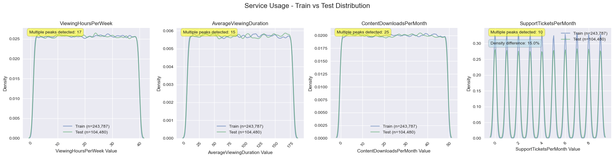
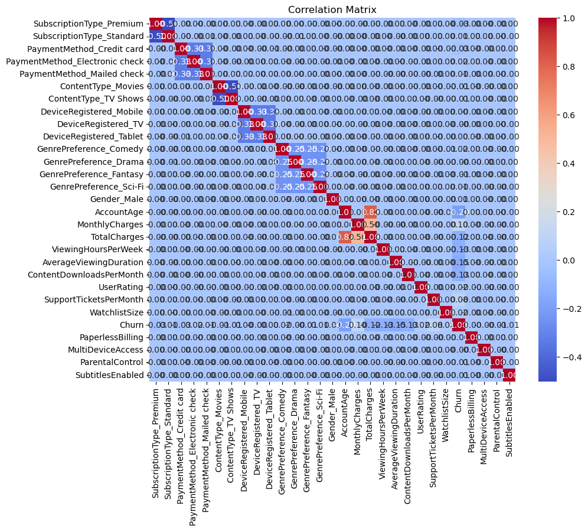

# Customer Churn Prediction Modeling

This project focuses on predicting customer churn using machine learning models.  
It applies data preprocessing, feature engineering, and classification techniques to help businesses identify at-risk customers and take proactive actions.

---

## 📊 Project Overview
- **Goal:** Predict customer churn and understand the key drivers of churn.  
- **Dataset:** Customer records with demographic, account, and usage features.  
- **Approach:**  
  - Data cleaning & preprocessing  
  - Exploratory Data Analysis (EDA)
    
  - Feature engineering
    
  - Model training (Logistic Regression, Random Forest, Gradient Boosting, etc.)  
  - Model evaluation (Accuracy, Precision, Recall, F1-score, ROC-AUC)

---

## ⚙️ Tools & Technologies
- Python (pandas, NumPy, scikit-learn, matplotlib, seaborn)  
- Jupyter Notebook  
- Git & GitHub for version control  

---

## 📁 Repository Structure
